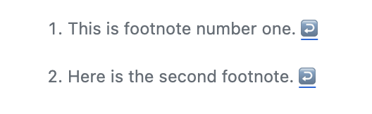
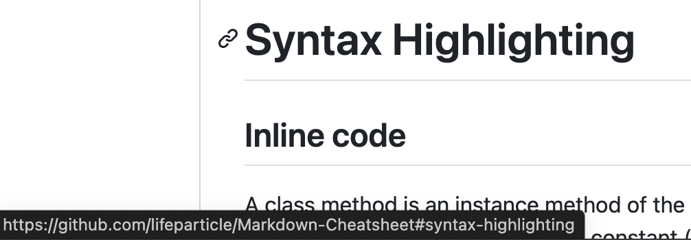
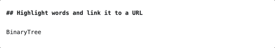
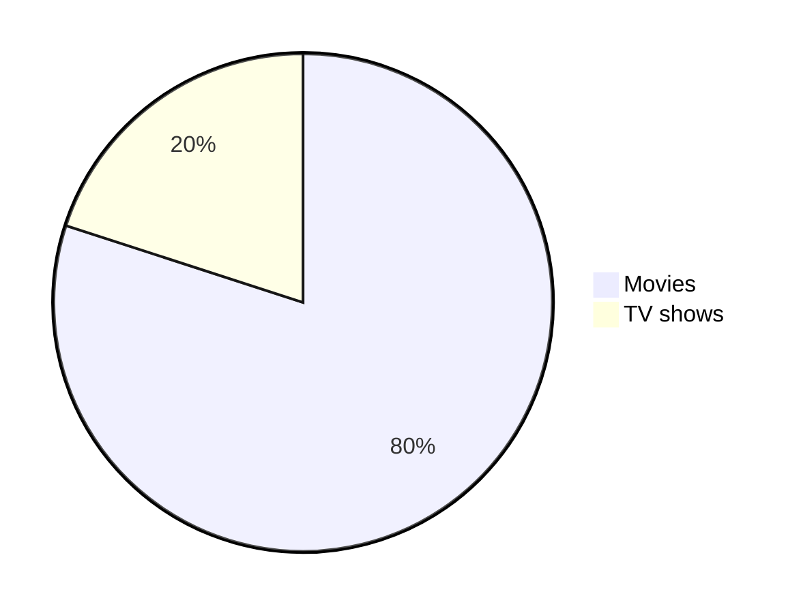
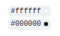
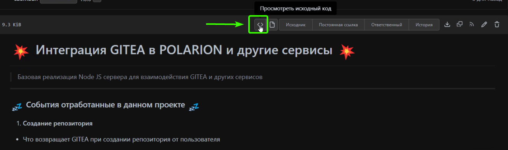
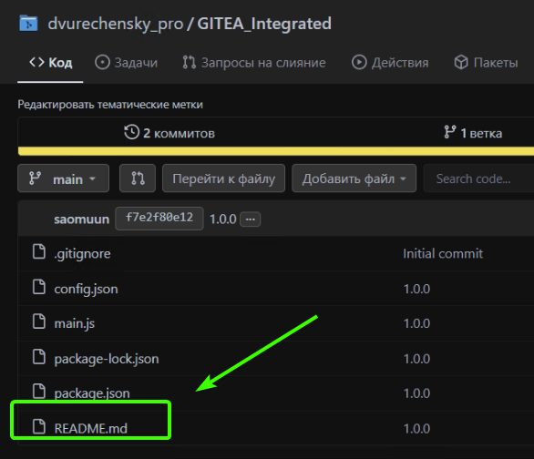
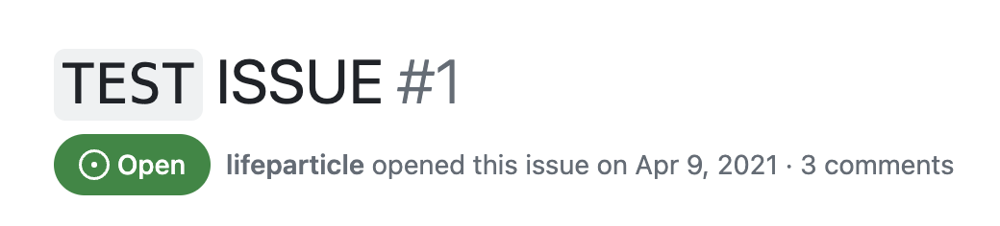

<h1 align="center">
  ⚫Шпаргалка по Markdown⚫
</h1>

<a name="top"></a>

<br/>

- [Введение](#введение)
- [Заголовки](#заголовки)
- [Стили текста](#стили-текста)
  - [Нормальный](#нормальный)
  - [Жирный](#жирный)
  - [Курсив](#курсив)
  - [Полужирный и курсив](#полужирный-и-курсив)
  - [Кавычки](#кавычки)
  - [Моношрифт](#моношрифт)
  - [Подчеркнуто](#подчеркнуто)
  - [Strike-through](#strike-through)
  - [Boxed](#boxed)
  - [Подпись](#подпись)
  - [Надстрочный](#надстрочный)
  - [Цвет текста](#цвет-текста)
  - [Многострочный](#многострочный)
- [Подсветка синтаксиса](#подсветка-синтаксиса)
  - [Встроенный код](#встроенный-код)
  - [Блок кода](#блок-кода)
  - [Блок дифф-кода](#блок-дифф-кода)
- [Выравнивания](#выравнивания)
- [Таблицы](#таблицы)
- [Ссылки](#ссылки)
  - [Линия](#линия)
  - [Ссылка](#ссылка)
  - [Сноска](#сноска)
  - [Относительный](#относительный)
  - [Авто](#авто)
  - [Раздел](#раздел)
  - [Наведение](#наведение)
  - [Закрытый](#закрытый)
  - [Выделение слов и ссылка на URL](#выделение-слов-и-ссылка-на-url)
- [Изображения](#изображения)
- [Значки](#значки)
- [Списки](#списки)
  - [Упорядоченные](#упорядоченные)
  - [Неупорядоченные](#неупорядоченные)
  - [Задание](#задание)
- [Кнопки](#кнопки)
  - [Кнопка с эмодзи](#кнопка-с-эмодзи)
- [Складные элементы](#складные-элементы)
- [Горизонтальное правило](#горизонтальное-правило)
- [Диаграммы](#диаграммы)
- [Математические выражения](#математические-выражения)
- [Оповещения](#оповещения)
- [Упоминание людей и команд](#упоминание-людей-и-команд)
- [Ссылки на проблемы и запросы на исправление](#ссылки-на-проблемы-и-запросы-на-исправление)
- [Цветные модели](#цветные-модели)
- [Просмотр кода](#просмотр-кода)
- [Код в заголовках](#код-в-заголовках)
- [Другое](#другое)
  - [ Жми эту кнопку ↗️ ](#-жми-эту-кнопку-️-)

# Введение

Markdown - это способ написания рич-текста (форматированного текста) с использованием синтаксиса форматирования обычного текста. Это также инструмент, который преобразует форматирование обычного текста в HTML.

- **2004:** Джон Грубер разработал Markdown.
- **2014:** CommonMark был создан как стандартная спецификация Markdown для устранения несоответствий и двусмысленностей в реализациях Markdown. Эта инициатива была инициирована Джоном Макфарлейном и поддержана другими энтузиастами Markdown для обеспечения надежной и последовательной спецификации.

Это руководство даст вам полное представление о ключевых командах в Gitea Flavored Markdown (GFM), который является строгим супернабором CommonMark.

# Заголовки

```md
# World 1
## World 2
### World 3
#### World 4
##### World 5
###### World 6
```
<!-- omit in toc -->
# World 1
<!-- omit in toc -->
## World 2
<!-- omit in toc -->
### World 3
<!-- omit in toc -->
#### World 4
<!-- omit in toc -->
##### World 5
<!-- omit in toc -->
###### World 6

```md
<h1>World 1</h1>
<h2>World 2</h2>
<h3>World 3</h3>
<h4>World 4</h4>
<h5>World 5</h5>
<h6>World 6</h6>
```

<!-- omit in toc -->
<h1>World 1</h1>
<!-- omit in toc -->
<h2>World 2</h2>
<!-- omit in toc -->
<h3>World 3</h3>
<!-- omit in toc -->
<h4>World 4</h4>
<!-- omit in toc -->
<h5>World 5</h5>
<!-- omit in toc -->
<h6>World 6</h6>

```md
World 1
=
World 2
-
```

<!-- omit in toc -->
World 1 <!-- markdownlint-disable MD003 -->
=
<!-- omit in toc -->
World 2 <!-- markdownlint-disable MD003 -->
-

# Стили текста

## Нормальный

```md
Все любят чай.
```

Все любят чай.

## Жирный

Mac: <kbd>command+B</kbd>

Windows: <kbd>control+B</kbd>

```md
**Все любят чай.**
__Все любят чай.__
<strong>Все любят чай.</strong>
```

**Все любят чай.**

<!-- markdownlint-disable-next-line MD050 -->
__Все любят чай.__

<strong>Все любят чай.</strong>

## Курсив

Mac: <kbd>command+I</kbd>

Windows: <kbd>control+I</kbd>

```md
*Все любят чай.*
_Все любят чай._
<em>Все любят чай.</em>
```

*Все любят чай.*

<!-- markdownlint-disable-next-line MD049 -->
_Все любят чай._

<em>Все любят чай.</em>

## Полужирный и курсив

```md
**_Все любят чай._**
<strong><em>Все любят чай.</em></strong>
```
<!-- markdownlint-disable-next-line MD049 -->
**_Все любят чай._**

<strong><em>Все любят чай.</em></strong>

## Кавычки

Mac: <kbd>command+shift+.</kbd>

Windows: <kbd>control+shift+.</kbd>

```md
> Все любят чай.

<br>

> Все любят чай.\
> Все любят чай.\
> Все любят чай.

<br>

> Все любят чай.
>> Все любят чай.
>>> Все любят чай.

<br>

> **Все любят** *пить кофе и чай с печеньем по утрам.*
```

> Все любят чай.

<br>

> Все любят чай.\
> Все любят чай.\
> Все любят чай.

<br>

> Все любят чай.
>> Все любят чай.
>>> Все любят чай.

<br>

> **Все любят** *пить кофе и чай с печеньем по утрам.*

## Моношрифт

```md
<samp>Все любят чай.</samp>
```

<samp>Все любят чай.</samp>

## Подчеркнуто

```md
<ins>Все любят чай.</ins>
```

<ins>Все любят чай.</ins>

## Strike-through

```md
~~Все любят чай.~~
```

~~Все любят чай.~~

```md
<pre>
Привет как дела? <strike>Плохо.</strike> Приходи на работу. <strike>Не хочу.</strike>
</pre>
```

<pre>
Привет как дела? <strike>Плохо..</strike> Приходи на работу. <strike>Не хочу.</strike>
</pre>

````md
<strike>

```js
console.log('Error');
```

</strike>
````

<strike>

```js
console.log('Error');
```

</strike>

## Boxed

```md
<table><tr><td>Все любят чай.</td></tr></table>
```

<table><tr><td>Все любят чай.</td></tr></table>

## Подпись

```md
log<sub>2</sub>(x)
Subscript <sub>Все любят чай.</sub>
```

log<sub>2</sub>(x)

Subscript <sub>Все любят чай.</sub>

## Надстрочный

```md
2 <sup>53-1</sup> и -2 <sup>53-1</sup>
Надстрочный <sup>Все любят чай.</sup>
```

2 <sup>53-1</sup> и -2 <sup>53-1</sup>

Надстрочный <sup>Все любят чай.</sup>

## Цвет текста

Использование синтаксиса MathJax:

| Название цвета      | Код                                                                                         | Пример                                                        |
|-----------------|----------------------------------------------------------------------------------------------|----------------------------------------------------------------|
| Apricot         | `$\color{Apricot}{Все\ любят\ пить\ кофе\ и\ чай\ с\ печеньем\ по утрам.}$`                    | $\color{Apricot}{Все\ любят\ пить\ кофе\ и\ чай\ с\ печеньем\ по утрам.}$      |
| Aquamarine      | `$\color{Aquamarine}{Все\ любят\ пить\ кофе\ и\ чай\ с\ печеньем\ по утрам.}$`                 | $\color{Aquamarine}{Все\ любят\ пить\ кофе\ и\ чай\ с\ печеньем\ по утрам.}$   |
| Bittersweet     | `$\color{Bittersweet}{Все\ любят\ пить\ кофе\ и\ чай\ с\ печеньем\ по утрам.}$`                | $\color{Bittersweet}{Все\ любят\ пить\ кофе\ и\ чай\ с\ печеньем\ по утрам.}$  |
| Black           | `$\color{Black}{Все\ любят\ пить\ кофе\ и\ чай\ с\ печеньем\ по утрам.}$`                      | $\color{Black}{Все\ любят\ пить\ кофе\ и\ чай\ с\ печеньем\ по утрам.}$        |

[Full Table](https://www.dvurechensky.pro/dvurechensky_pro/MathJaxColorsMarkdown)

## Многострочный

Быстрый\
бурая лиса\
перепрыгивает через\
ленивую собаку.

```md
Быстрая\
коричневая лиса\
перепрыгивает через\
ленивую собаку.
```

# Подсветка синтаксиса

## Встроенный код

Метод класса - это метод экземпляра объекта класса. При создании нового класса инициализируется объект типа `Class`, которому присваивается глобальная константа (в данном случае Mobile).

Вы можете использовать <kbd>command + e </kbd> на Mac или <kbd>control + e</kbd> на Windows чтобы вставить встроенный код.

## Блок кода

```csharp
public static String monthNames[] = {"January", "February", "March", "April", "May", "June", "July", "August", "September", "October", "November", "December"};
```

````md
```csharp
public static String monthNames[] = {"January", "February", "March", "April", "May", "June", "July", "August", "September", "October", "November", "December"};
```
````

```java
public static String monthNames[] = {"January", "February", "March", "April", "May", "June", "July", "August", "September", "October", "November", "December"};
```

````md
```java
public static String monthNames[] = {"January", "February", "March", "April", "May", "June", "July", "August", "September", "October", "November", "December"};
```
````

## Блок дифф-кода

```diff
## git diff a/test.txt b/test.txt
diff --git a/a/test.txt b/b/test.txt
index 309ee57..c995021 100644
--- a/a/test.txt
+++ b/b/test.txt
@@ -1,8 +1,6 @@
-Все любят чай.
+Все не любят пить кофе и чай с печеньем по утрам.

 a
-b
 c
 d
-e
 f
```

````md
```diff
## git diff a/test.txt b/test.txt
diff --git a/a/test.txt b/b/test.txt
index 309ee57..c995021 100644
--- a/a/test.txt
+++ b/b/test.txt
@@ -1,8 +1,6 @@
-Все любят чай.
+Все не любят пить кофе и чай с печеньем по утрам.

 a
-b
 c
 d
-e
 f
```
````

```diff
- Красный текст
+ Зелёный текст
! Синий текст
# Серый текст
@@ Пурпурный и жирный текст @@
```

````md
```diff
- Красный текст
+ Зелёный текст
! Синий текст
# Серый текст
@@ Пурпурный и жирный текст @@
```
````

# Выравнивания

```md
<p align="left">

</p>
```

<p align="left">
<!-- markdownlint-disable-next-line MD013 -->

</p>

```md
<p align="center">

</p>
```

<p align="center">
<!-- markdownlint-disable-next-line MD013 -->

</p>

```md
<p align="right">

</p>
```

<p align="right">
<!-- markdownlint-disable-next-line MD013 -->

</p>

```md
<h3 align="center"> Мой подарок для вас </h3>
```

<!-- omit in toc -->
<h3 align="center"> Мой подарок для вас </h3>

# Таблицы

```md
<table>
<tr>
<td width="33%"">
Все любят чай.
</td>
<td width="33%">
Все любят чай.
</td>
<td width="33%">
Все любят чай.
</td>
</tr>
</table>
```

<table>
<tr>
<td width="33%"">
Все любят чай.
</td>
<td width="33%">
Все любят чай.
</td>
<td width="33%">
Все любят чай.
</td>
</tr>
</table>

```md
| По умолчанию | Выравнивание по левому краю | Выравнивание по центру | Выравнивание по правому краю |
| - | :- | :-: | -: |
| 9999999999 | 9999999999 | 9999999999 | 9999999999 |
| 999999999 | 999999999 | 999999999 | 999999999 |
| 99999999 | 99999999 | 99999999 | 99999999 |
| 9999999 | 9999999 | 9999999 | 9999999 |

| По умолчанию | Выравнивание по левому краю | Выравнивание по центру | Выравнивание по правому краю |
| ---------- | :--------- | :----------: | ----------: |
| 9999999999 | 9999999999 | 9999999999   | 9999999999  |
| 999999999  | 999999999  | 999999999    | 999999999   |
| 99999999   | 99999999   | 99999999     | 99999999    |
| 9999999    | 9999999    | 9999999      | 9999999     |

| По умолчанию | Выравнивание по левому краю | Выравнивание по центру | Выравнивание по правому краю |
---------- | :--------- | :----------: | ----------:
9999999999 | 9999999999 | 9999999999   | 9999999999
999999999  | 999999999  | 999999999    | 999999999
99999999   | 99999999   | 99999999     | 99999999
9999999    | 9999999    | 9999999      | 9999999
```

| По умолчанию | Выравнивание по левому краю | Выравнивание по центру | Выравнивание по правому краю |
| - | :- | :-: | -: |
| 9999999999 | 9999999999 | 9999999999 | 9999999999 |
| 999999999 | 999999999 | 999999999 | 999999999 |
| 99999999 | 99999999 | 99999999 | 99999999 |
| 9999999 | 9999999 | 9999999 | 9999999 |

| По умолчанию | Выравнивание по левому краю | Выравнивание по центру | Выравнивание по правому краю |
| ---------- | :--------- | :----------: | ----------: |
| 9999999999 | 9999999999 | 9999999999   | 9999999999  |
| 999999999  | 999999999  | 999999999    | 999999999   |
| 99999999   | 99999999   | 99999999     | 99999999    |
| 9999999    | 9999999    | 9999999      | 9999999     |

<!-- markdownlint-disable MD055 -->
| По умолчанию | Выравнивание по левому краю | Выравнивание по центру | Выравнивание по правому краю |
---------- | :--------- | :----------: | ----------:
9999999999 | 9999999999 | 9999999999   | 9999999999
999999999  | 999999999  | 999999999    | 999999999
99999999   | 99999999   | 99999999     | 99999999
9999999    | 9999999    | 9999999      | 9999999
<!-- markdownlint-enable MD055 -->

```md
<table>
<tr>
<th>World 1</th>
<th>World 2</th>
</tr>
<tr>

<td>

| A | B | C |
|--|--|--|
| 1 | 2 | 3 |

</td><td>

| A | B | C |
|--|--|--|
| 1 | 2 | 3 |

</td></tr> </table>
```

<table>
<tr>
<th>World 1</th>
<th>World 2</th>
</tr>
<tr>

<td>

| A | B | C |
|--|--|--|
| 1 | 2 | 3 |

</td><td>

| A | B | C |
|--|--|--|
| 1 | 2 | 3 |

</td></tr> </table>

```md
| A | B | C |
|---|---|---|
| 1 | 2 | 3 <br/> 4 <br/> 5 |
```

| A | B | C |
|---|---|---|
| 1 | 2 | 3 <br/> 4 <br/> 5 |

```md
<table>
<tr>
<th>Перед подъемом</th>
<th>После подъема</th>
</tr>
<tr>
<td>
<pre lang="js">
console.log(fullName); // undefined
fullName = "Nikolay Dvurechensky";
console.log(fullName); // Nikolay Dvurechensky
var fullName;
</pre>
</td>
<td>
<pre lang="js">
var fullName;
console.log(fullName); // undefined
fullName = "Nikolay Dvurechensky";
console.log(fullName); // Nikolay Dvurechensky
</pre>
</td>
</tr>
</table>
```

<table>
<tr>
<th>Перед подъемом</th>
<th>После подъема</th>
</tr>
<tr>
<td>
<pre lang="js">
console.log(fullName); // undefined
fullName = "Nikolay Dvurechensky";
console.log(fullName); // Nikolay Dvurechensky
var fullName;
</pre>
</td>
<td>
<pre lang="js">
var fullName;
console.log(fullName); // undefined
fullName = "Nikolay Dvurechensky";
console.log(fullName); // Nikolay Dvurechensky
</pre>
</td>
</tr>
</table>

# Ссылки

## Линия

```md
[GITEA](https://www.dvurechensky.pro/)
```

[GITEA](https://www.dvurechensky.pro/)

## Ссылка

```md
[GITEA][reference text]

[GITEA][1]

[GITEA]

[reference text]: https://www.dvurechensky.pro/
[1]: https://www.dvurechensky.pro/
[GITEA]: https://www.dvurechensky.pro/
```

[GITEA][reference text]

[GITEA][1]

[GITEA]

[reference text]: https://www.dvurechensky.pro/
[1]: https://www.dvurechensky.pro/
[GITEA]: https://www.dvurechensky.pro/

## Сноска

Сноска.[^1]

Еще одна важная сноска.[^2]

[^1]: Это сноска номер один.
[^2]: Вот вторая сноска.

```md
Сноска.[^1]

Какая-то другая важная сноска.

[^1]: Это сноска номер один.
[^2]: Вот вторая сноска.
```



## Относительный

```md
[Пример относительной ссылки](https://www.dvurechensky.pro/dvurechensky_pro/MathJaxColorsMarkdown)
```

[Пример относительной ссылки](https://www.dvurechensky.pro/dvurechensky_pro/MathJaxColorsMarkdown)

## Авто

```md
Посетите https://www.dvurechensky.pro/
```

Посетите https://www.dvurechensky.pro/

```md
Email - example@example.com
```

Email - example@example.com

## Раздел



## Наведение

Вы можете использовать [GITEA](https://www.dvurechensky.pro/ "Набор инструментов для повышения производительности разработчиков, призванных помочь вам сэкономить время") для создания таблиц markdown.

Вы можете использовать [GITEA](## "Набор инструментов для повышения производительности разработчиков, призванных помочь вам сэкономить время")  для создания таблиц markdown.

## Закрытый

```md
<https://www.dvurechensky.pro/>
```

<https://www.dvurechensky.pro/>

## Выделение слов и ссылка на URL

```md
[GITEA](https://www.dvurechensky.pro/)
```

[GITEA](https://www.dvurechensky.pro/)



# Изображения

Альтернативный текст и заголовок не являются обязательными.

```md

```


```md
![alt text][image]

[image]: MEDIA/i8.jfif "Title text"
```

![alt text][image]

[image]: MEDIA/i8.jfif "Title text"

```md

```

<!-- markdownlint-disable-next-line MD013 -->


```md

```


```md

```

[](#)

```md
[](#)
```

<a href='#' target='_blank'>  </a>

```md
<a href='https://binarytree.dev/' target='_blank'>  </a>
```

<a href='https://binarytree.dev/' target='_blank'>  </a>

# Значки

```md

```


# Списки

## Упорядоченные

Mac: <kbd>command+shift+7</kbd>

Windows: <kbd>control+shift+7</kbd>

```md
1. One
2. Two
3. Three
```

1. One
2. Two
3. Three

```md
1. First level
    1. Second level
        - Third level
            - Fourth level
2. First level
    1. Second level
3. First level
    1. Second level
```

1. First level
    1. Second level
        - Third level
            - Fourth level
2. First level
    1. Second level
3. First level
    1. Second level

## Неупорядоченные

Mac: <kbd>command+shift+8</kbd>

Windows: <kbd>control+shift+8</kbd>

```md
* 1
* 2

+ 1
+ 2

- 1
- 2
```

* 1
* 2

+ 1
+ 2

- 1
- 2

```md
- First level
  - Second level
    - Third level
      - Fourth level
- First level
  - Second level
- First level
  - Second level
```

- First level
  - Second level
    - Third level
      - Fourth level
- First level
  - Second level
- First level
  - Second level

```md
<ul>
<li>First item</li>
<li>Second item</li>
</ul>
```

<ul>
<li>First item</li>
<li>Second item</li>
</ul>

## Задание

```md
- [x] Исправить ошибку 223
- [ ] Добавить функцию 33
```

- [x] Исправить ошибку 223
- [ ] Добавить функцию 33

# Кнопки

```md
<kbd>cmd + shift + p</kbd>
```

<kbd>cmd + shift + p</kbd>

```md
<kbd> <br> cmd + shift + p <br> </kbd>
```

<kbd> <br> cmd + shift + p <br> </kbd>

```md
<kbd>[Математика в Markdown](https://www.dvurechensky.pro/dvurechensky_pro/MathMarkdown)</kbd>
```

<kbd>[Математика в Markdown](https://www.dvurechensky.pro/dvurechensky_pro/MathMarkdown)</kbd>

```md
[<kbd>Математика в Markdown</kbd>](https://www.dvurechensky.pro/dvurechensky_pro/MathMarkdown)
```

[<kbd>Математика в Markdown</kbd>](https://www.dvurechensky.pro/dvurechensky_pro/MathMarkdown)

## Кнопка с эмодзи

<kbd> <br> [Математика в Markdown](https://www.dvurechensky.pro/dvurechensky_pro/MathMarkdown) ↗️ <br> </kbd>

```md
<kbd> <br> [Математика в Markdown](https://www.dvurechensky.pro/dvurechensky_pro/MathMarkdown) ↗️ <br> </kbd>
```

# Складные элементы

```md
<details>
  <summary>Markdown</summary>

- <kbd>[Emoji](https://www.dvurechensky.pro/dvurechensky_pro/EmojiCollectionsMarkdown_Markdown)</kbd>
- <kbd>[Математика в Markdown](https://www.dvurechensky.pro/dvurechensky_pro/MathMarkdown)</kbd>

</details>
```

<details>
  <summary>Markdown</summary>

- <kbd>[Emoji](https://www.dvurechensky.pro/dvurechensky_pro/EmojiCollectionsMarkdown_Markdown)</kbd>
- <kbd>[Математика в Markdown](https://www.dvurechensky.pro/dvurechensky_pro/MathMarkdown)</kbd>

</details>

# Горизонтальное правило

```md
---
***
___
```

---
***
___

# Диаграммы

````md

````


# Математические выражения

> [!IMPORTANT]
> Ознакомьтесь с [представлением математики](https://www.dvurechensky.pro/dvurechensky_pro/MathMarkdown) в Markdown.

```md
Это встроенное математическое выражение $x = {-b \pm \sqrt{b^2-4ac} \over 2a}$
```

Это встроенное математическое выражение $x = {-b \pm \sqrt{b^2-4ac} \over 2a}$

```md
$$
x = {-b \pm \sqrt{b^2-4ac} \over 2a}
$$
```

$$
x = {-b \pm \sqrt{b^2-4ac} \over 2a}
$$

# Оповещения

```md
> [!NOTE]
> Важные детали, которые пользователи не должны упускать из виду даже при быстром просмотре.

<br>

> [!TIP]
>  Дополнительные советы, которые помогут пользователям добиться лучших результатов.

<br>

> [!IMPORTANT]
> Важная информация, необходимая пользователям для достижения успеха.

<br>

> [!WARNING]
> Срочное содержание, требующее немедленного внимания пользователя из-за возможного риска.

<br>

> [!CAUTION]
> Возможные негативные последствия действия.
```

> [!NOTE]
> Важные детали, которые пользователи не должны упускать из виду даже при быстром просмотре.

<br>

> [!TIP]
>  Дополнительные советы, которые помогут пользователям добиться лучших результатов.

<br>

> [!IMPORTANT]
> Важная информация, необходимая пользователям для достижения успеха.

<br>

> [!WARNING]
> Срочное содержание, требующее немедленного внимания пользователя из-за возможного риска.

<br>

> [!CAUTION]
> Возможные негативные последствия действия.

# Упоминание людей и команд

В вопросах:

```md
@dvurechensky_pro
```

В файле разметки:

```md
https://www.dvurechensky.pro/dvurechensky_pro
```

https://www.dvurechensky.pro/dvurechensky_pro

# Ссылки на проблемы и запросы на исправление

В вопросах:

```md
#1
```

[Пример показан в выпуске](https://www.dvurechensky.pro/dvurechensky_pro/GITEA_Integrated/issues/1)

В файле разметки:

```md
https://www.dvurechensky.pro/dvurechensky_pro/GITEA_Integrated/issues/1
```

https://www.dvurechensky.pro/dvurechensky_pro/GITEA_Integrated/issues/1

# Цветные модели

В выпусках:

```md
`#ffffff`
`#000000`
```

[Пример показан в выпуске](https://github.com/lifeparticle/Markdown-Cheatsheet/issues/1)



# Просмотр кода

Щелкните по опции Code (справа вверху) или Raw (слева вверху), чтобы увидеть код уценки.



> [!NOTE]
> Убедитесь, что вы щелкнули файл разметки, чтобы увидеть вид выше.



# Код в заголовках

В заголовках выпусков и запросов на вытягивание.

`TEST` ISSUE

```md

`TEST` ISSUE

```



---

# Другое

<kbd> [Жми эту кнопку](OTHER.md) ↗️ </kbd>
---